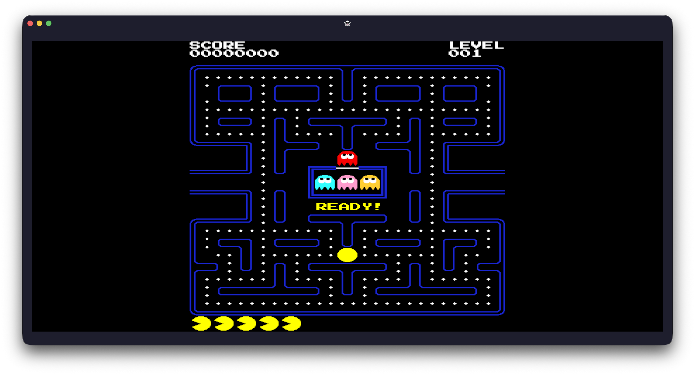
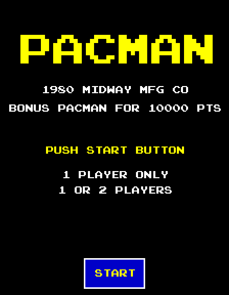

# PacMan

---

This is a rust implmentation of Pacman rendered with Kitty graphics.

<!-- markdownlint-disable MD033 -->

  

<!-- markdownlint-enable MD033 -->

Run targets:

- `cargo run`
- `make run`
- `cargo test`
- `cargo fmt --check`
- `cargo clippy --all-targets -- -D warnings`
- `make ci`
- `make coverage`
- `make sq-ci`
- `make sq`
- `cargo run --example generate_start_sequence_gif`
- `cargo run --example headless_autopilot`

Run this inside `kitty`, `ghostty`, `warp` or another terminal that supports the
Kitty graphics protocol.

## Install

Install directly from git with Cargo:

- `cargo install --git https://github.com/stephenlclarke/pacman pacman`

`cargo install` builds with Cargo's release profile by default. Do not pass
`--debug` unless you explicitly want a slower debug build.

After installation, run the game with:

- `pacman`

Notes:

- Run it inside `kitty`, `ghostty`, `warp`, or another terminal that supports
  the Kitty graphics protocol.
- Download Ghostty: <https://ghostty.org/download>
- Download Warp: <https://www.warp.dev/download>
- If `pacman` is not found after installation, ensure `~/.cargo/bin` is on your
  `PATH`.

## SonarQube

- `make sq-ci` generates the Cobertura coverage report used by the SonarCloud
  workflow in CI.
- `make sq` runs the same coverage step locally and then invokes
  `sonar-scanner`.
- Local SonarQube scans require `cargo-llvm-cov`, `sonar-scanner`, and a
  `SONAR_TOKEN` environment variable.

## XYZZY Mode

After starting the game, type `X`, `Y`, `Z`, `Z`, `Y` to toggle `XYZZY` mode on
or off. Pacman blinks three times when the mode changes.

Letter-key controls accept either upper- or lower-case input.

Extra keys while `xyzzy` mode is active:

- `A`: toggle autopilot. This will route Pacman around the maze to clear pellets,
  pick up fruit, chase frightened ghosts when it is worthwhile, and delay power
  pellets until they are useful. Autopilot turns off automatically when the
  level has no pellets left.
- `F`: toggle forced freight mode for the ghosts.
- `R`: reset all ghosts back to their starting positions.
- `T`: teleport Pacman to the safest valid node on the map.

## ROM References

These online references have been useful while translating the Midway Pac-Man
ROMs into native Rust rather than emulating the Z80 code directly:

- [pacmancode.com](https://pacmancode.com): original lesson sequence this repo
  started from before the arcade-ROM translation work.
- [Midway Pacman ROMS](https://www.retrostic.com/roms/mame/pac-man-40808):
  Original Midway Arcade Pacman ROMS
- [Pacman hardware](https://www.walkofmind.com/programming/pie/hardware.htm):
  CPU/video memory map, palette PROM layout, sprite registers, and screen
  rotation details.
- [Pacman character definitions](https://walkofmind.com/programming/pie/char_defs.htm):
  character ROM byte layout and rotated tile decoding details.
- [Characters, sprites and colours](https://pacmanc.blogspot.com/2024/05/characters-sprites-and-colours.html):
  practical notes on character ranges, sprite ranges, maze wall characters,
  tunnel and ghost-house color markers, and fruit/icon character tables.
- [Pac-Man Emulation Guide](https://www.lomont.org/software/games/pacman/PacmanEmulation.pdf):
  hardware-oriented reference for palettes, video layout, sprite ordering, and
  general ROM structure.

## Platform Support

Sound effects and music are embedded in the binary and played in-process using
`rodio` on top of `cpal`. That removes the previous dependency on a
platform-specific command such as `/usr/bin/afplay` and makes the audio path
portable across macOS and Linux.

macOS is still the only platform that has been actively validated. Most of the
rendering and terminal code is already Unix-oriented, and the audio layer no
longer needs a separate Linux backend, but Linux support has not been tested
end to end yet.

To finish Linux support, the remaining work is:

- Verify Kitty graphics protocol support and terminal pixel sizing on Linux
  terminals such as Kitty and Ghostty, since rendering depends on a compatible
  terminal and `ioctl(TIOCGWINSZ)` reporting usable pixel dimensions.
- Run the game on real Linux machines or CI runners to confirm that `rodio` can
  open the default audio device cleanly on ALSA, PulseAudio, or PipeWire-backed
  setups.
- Add Linux-specific install notes for terminal choice, audio stack quirks, and
  any distro packages needed for building or running the app.
- Expand the test and release matrix so Linux builds and smoke tests are kept
  healthy going forward.
