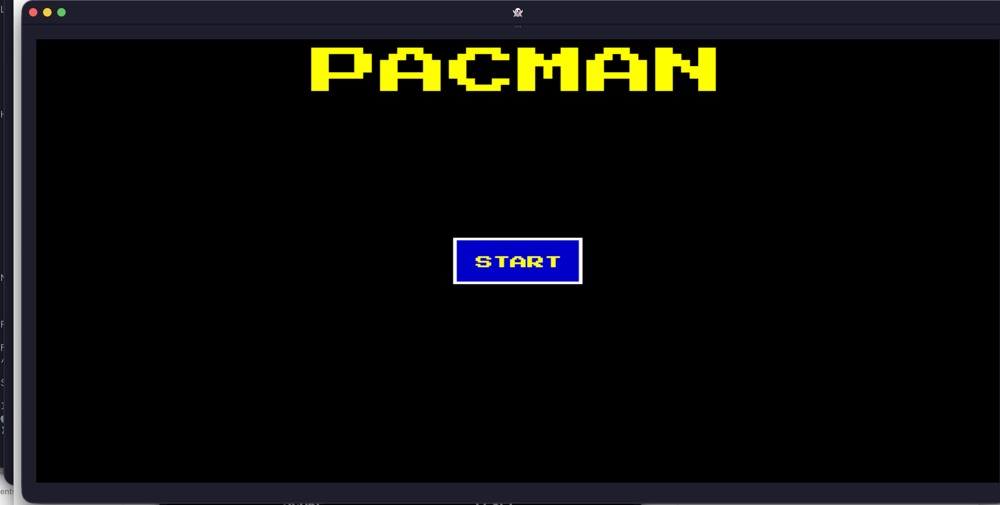

# pacman

This branch contains the Level 7 lesson state from
[pacmancode.com](https://pacmancode.com), rendered with Kitty graphics.

Run targets:

- `cargo run -- add-title-screen`
- `cargo run -- add-buttons`
- `cargo run -- add-sound-music`
- `cargo run -- level7`

Run this inside `kitty`, `ghostty`, or another terminal that supports the
Kitty graphics protocol.

