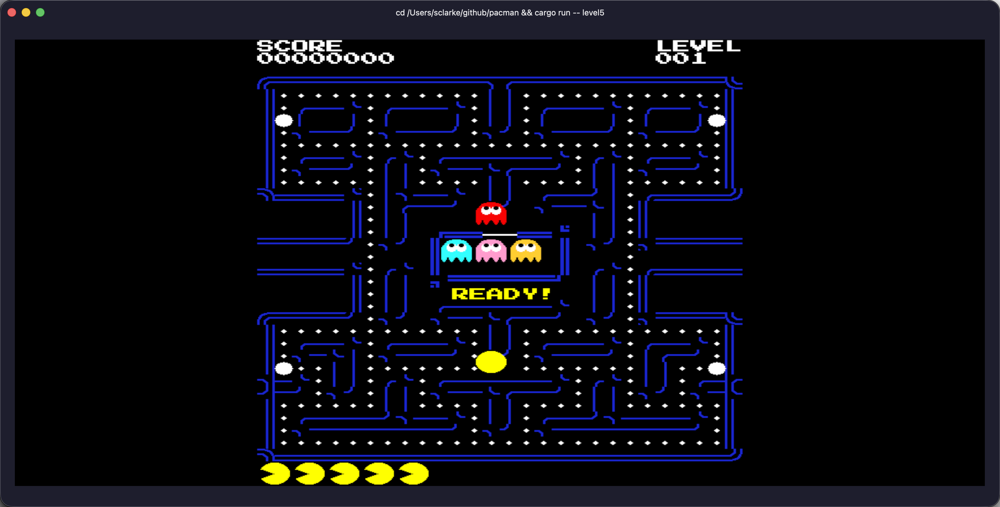

# pacman

This branch contains the Level 5 lesson state from
[pacmancode.com](https://pacmancode.com), rendered with Kitty graphics.

Run targets:

- `cargo run -- animate-ghosts`
- `cargo run -- level5`

Run this inside `kitty`, `ghostty`, or another terminal that supports the
Kitty graphics protocol.

